# MinIO File Synchronization Service

Python-based synchronization service designed to manage bidirectional file transfers between local filesystem and MinIO storage. This service is specifically designed for signstash operations, handling input files, processed outputs, and backup data with automatic cleanup.

## Logical Diagram

```mermaid
flowchart TB
    subgraph MinIO["MinIO Storage"]
        direction TB
        mInput["input/"]
        mOutput["output/"]
        mBackup["backup/"]
    end

    subgraph Local["Local Filesystem"]
        direction TB
        lInput["input/"]
        lOutput["output/"]
        lBackup["backup/"]
    end

    subgraph Processes["Sync Processes"]
        direction TB
        watch["File Watcher\n(inotify)"]
        verify["File Verification\n(MD5 Hash)"]
        cleanup["Cleanup Process\n(Age-based)"]
    end

    %% Input flow
    mInput -->|1. Download| lInput
    mInput -.->|2. Delete after\nsuccessful sync| delete1[("✓")]

    %% Output flow
    lOutput -->|1. Monitor changes| watch
    watch -->|2. Detect| verify
    verify -->|3. Upload| mOutput
    lOutput -.->|4. Delete after\nsuccessful sync| delete2[("✓")]

    %% Backup flow
    lBackup -->|1. Monitor changes| watch
    watch -->|2. Detect| verify
    verify -->|3. Upload| mBackup
    lBackup -.->|4. Delete after\nsuccessful sync| delete3[("✓")]

    %% Cleanup process
    cleanup -->|Clean files > MAX_AGE| lInput
    cleanup -->|Clean files > MAX_AGE| lOutput
    cleanup -->|Clean files > MAX_AGE| lBackup

    classDef storage fill:#f9f,stroke:#333,stroke-width:4px
    classDef process fill:#bbf,stroke:#333,stroke-width:2px
    classDef deletion fill:#fff,stroke:#333,stroke-width:1px,stroke-dasharray: 5 5
    
    class MinIO,Local storage
    class watch,verify,cleanup process
    class delete1,delete2,delete3 deletion
```



## Folder Structure on Server
.
+-- deploy
¦   +-- docker-compose.yml
+-- mnt
¦   +-- signstash
¦       +-- config
¦       ¦   +-- client-services-config.json
¦       +-- db
¦       +-- minio
¦       +-- sign

## Key Features

### Bidirectional Sync
- **Input Directory (MinIO → Local)**:
  - Downloads files from MinIO's 'input' directory to local filesystem
  - Automatically removes files from MinIO after successful download and verification
  - Maintains directory structure during sync

- **Output/Backup Directories (Local → MinIO)**:
  - Monitors local 'output' and 'backup' directories for changes
  - Uploads files to corresponding MinIO directories
  - Preserves complete directory hierarchies
  - Removes local files and directories after successful upload verification

### Automated Cleanup
- **File Age Management**:
  - Configurable maximum file age (default: 1 day)
  - Automatic removal of expired files from all directories
  - Cleanup of empty directories based on age criteria

- **Post-Sync Cleanup**:
  - Immediate removal of successfully synced files
  - Removal of empty directories after successful file sync
  - Verification of file integrity before deletion

### Safety Features
- **File Integrity**:
  - MD5 hash verification for all transfers
  - Ensures files are identical before deletion
  - Prevents data loss during transfer

- **Directory Handling**:
  - Safe directory removal after successful file syncs
  - Age-based cleanup for orphaned empty directories
  - Preservation of active directory structures

## Directory Structure
```
/home/sign/
├── input/   # Files downloaded from MinIO
├── output/  # Files to be uploaded to MinIO (cleaned after sync)
└── backup/  # Backup files to be uploaded to MinIO (cleaned after sync)
```

## Configuration

### Environment Variables

| Variable | Description | Default | Required |
|----------|-------------|---------|----------|
| MINIO_ENDPOINT | MinIO server address (host:port) | localhost:9000 | Yes |
| MINIO_ACCESS_KEY | MinIO access key | minioadmin | Yes |
| MINIO_SECRET_KEY | MinIO secret key | minioadmin | Yes |
| MINIO_BUCKET_NAME | Target bucket name | storage | Yes |
| FOLDER_PATH_SYNC | Base path for sync directories | /home/sign | No |
| MAX_FILE_AGE_DAYS | Maximum age of files before cleanup (days) | 1 | No |
| SYNC_INTERVAL | Sync check interval (seconds) | 5 | No |
| LOG_LEVEL | Logging level (INFO, DEBUG, etc.) | INFO | No |
| MINIO_SECURE | Use HTTPS connection | false | No |

### Important Notes
- MINIO_ENDPOINT should be in format `hostname:port` without protocol prefix or trailing slashes
- The service requires read/write access to all specified directories
- All operations are logged to stdout for integration with logging systems

## Running with Docker

### Basic Usage
```bash
docker run -d \
    -e MINIO_ENDPOINT=minio:9000 \
    -e MINIO_ACCESS_KEY=your_access_key \
    -e MINIO_SECRET_KEY=your_secret_key \
    -e MINIO_BUCKET_NAME=your_bucket \
    -e MAX_FILE_AGE_DAYS=1 \
    -v /your/local/path:/home/sign \
    signstash/minio-sync-service:latest
```

### With Custom Configuration
```bash
docker run -d \
    -e MINIO_ENDPOINT=minio:9000 \
    -e MINIO_ACCESS_KEY=your_access_key \
    -e MINIO_SECRET_KEY=your_secret_key \
    -e MINIO_BUCKET_NAME=your_bucket \
    -e MAX_FILE_AGE_DAYS=2 \
    -e SYNC_INTERVAL=10 \
    -e LOG_LEVEL=DEBUG \
    -e MINIO_SECURE=true \
    -v /your/local/path:/home/sign \
    signstash/minio-sync-service:latest
```

## Logging

The service provides detailed logging of all operations:
```
2024-11-26 01:27:35 [INFO] Uploaded to MinIO: backup/uuid-folder/file.txt
2024-11-26 01:27:35 [INFO] Verified and removed local file: backup/uuid-folder/file.txt
2024-11-26 01:27:35 [INFO] Removed empty directory after successful sync: /home/sign/backup/uuid-folder
```

### Log Types
- **INFO**: Normal operation logs (syncs, deletions, directory operations)
- **WARNING**: Non-critical issues that don't affect operation
- **ERROR**: Critical issues that require attention
- **DEBUG**: Detailed operation logs (when LOG_LEVEL=DEBUG)
